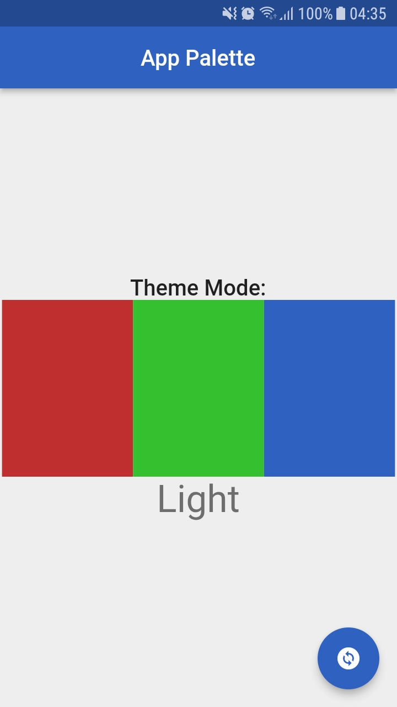
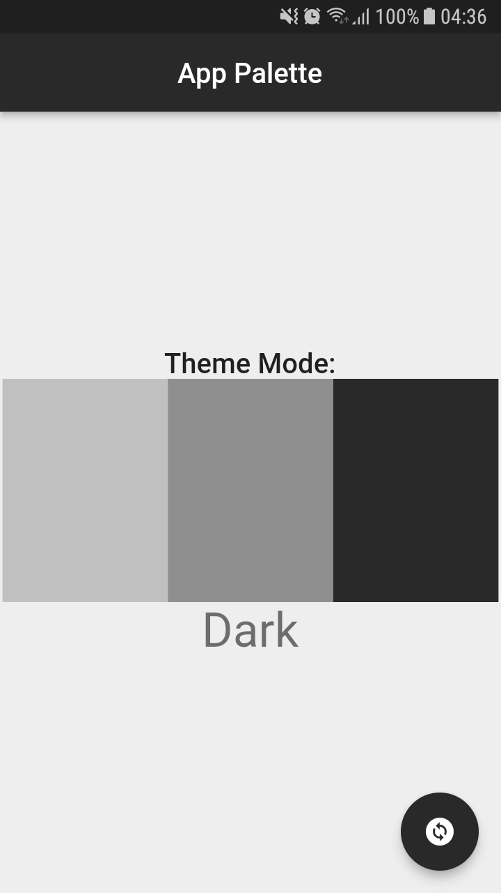

# **Color Palette Helper**

Simple way to change theme mode an app Flutter. Select static a color to paint your widgets.

### **ColorPalette**
~~~dart
import 'package:flutter/material.dart';

class ColorPalette extends ChangeNotifier {
  ColorPalette._();
  static ColorPalette instance = ColorPalette._();

  bool _isDarkTheme = false;
  static get isDarkTheme => instance._isDarkTheme;

  changeTheme() {
    _isDarkTheme = !_isDarkTheme;
    notifyListeners();
  }
}
~~~

### **Palette**
~~~dart
import 'package:flutter/material.dart';

import 'color_palette.dart';

class Palette extends ChangeNotifier {
  static bool get _colorPaletteTheme => ColorPalette.isDarkTheme;

  // #1
  static Color get primary =>
      _colorPaletteTheme ? const Color(0xFFC02F2F) : const Color(0xFFC0C0C0);
  // #2
  static Color get secondary =>
      _colorPaletteTheme ? const Color(0xFF34C02F) : const Color(0xFF8F8F8F);
  // #3
  static Color get tertiary =>
      _colorPaletteTheme ? const Color(0xFF2F62C0) : const Color(0xFF292929);
  // #4
  static Color get background => const Color(0xFFEEEEEE);
}
~~~

### **Example**
<tr></tr>
<tr></tr>

